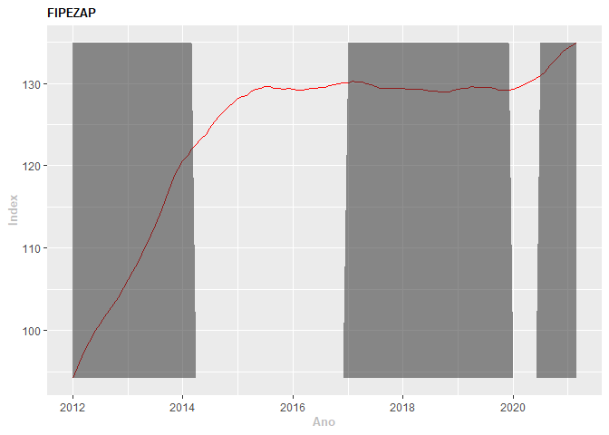
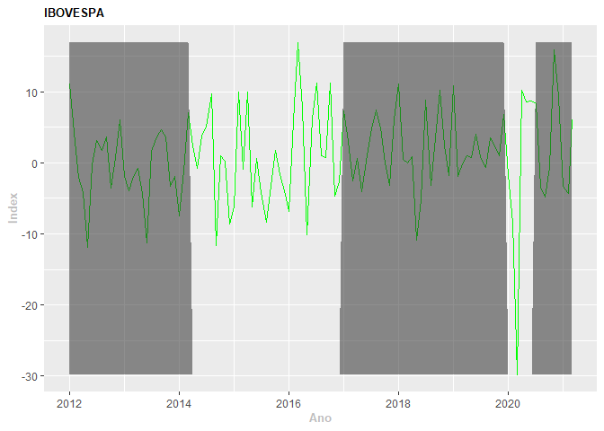
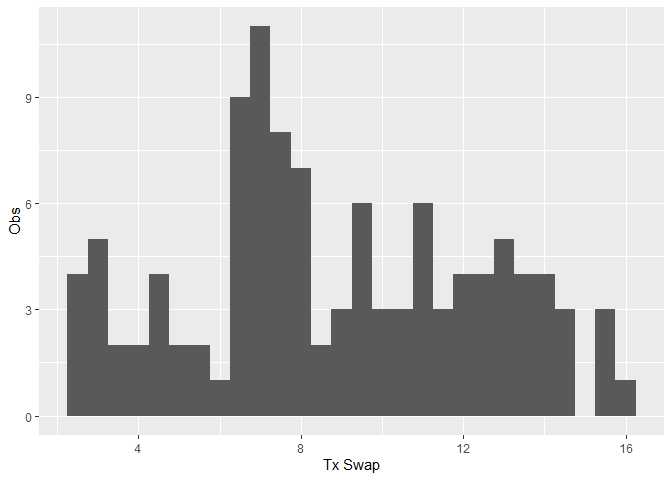
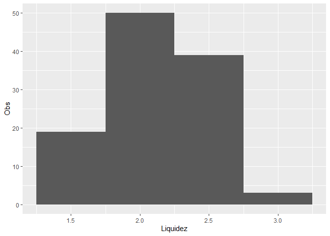
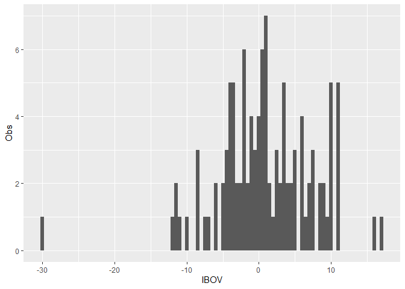
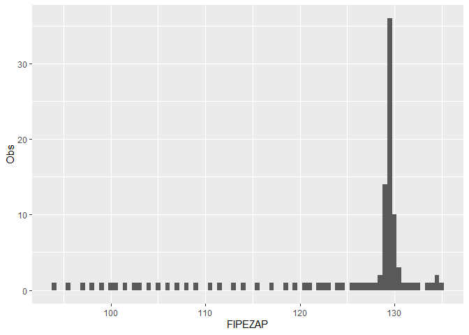
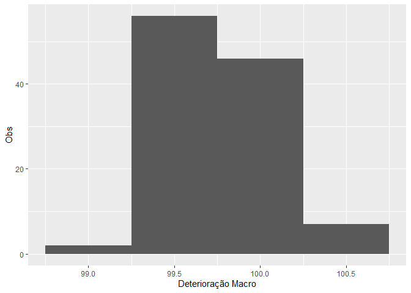

Relatório Dados Brasileiros
================
Gabriel Lopes Rodrigues
24 agosto, 2021

# **Introdução**

Ng (2010) incorpora aos modelos probit formulados por Kauppi e Saikkonen
(2008) diversos fatores de risco. A previsão se mostra mais assertiva se
comparada à trabalhos que utilizam apenas o spread da taxa de juros.

Os fatores de risco selecionados por Ng (2010) são dividos em quatro
categorias. 1 Expectativas do Mercado Financeiro; 2 Riscos de Liquidez
na Economia; 3 Riscos de prejuízos financeiros advindo do estouro de
bolhas e 4 sinais de deterioração macroeconômica. A variável dependente
do modelo é a datação de Ciclos de Negócios formulada pelo *National
Bureau of Economics Research*(**NBER**).

Para determinar **(1)** utiliza-se frequentemente a curva de juros
(*Spread 10 Year US Treasury Bond – 3 month Treasury Bills*). A teoria
por traz de sua utilização baseia-se no conceito de que esta reflete a
preferência por liquidez dos agentes econômicos ao computar o
diferencial da precificação do juro de curto prazo frente o juro de
longo prazo. Nesse sentido, quão maior o juro de curto prazo frente ao
juro de longo entende-se que há preferência por liquidez no curto prazo,
ou seja, instabilidade na economia. Portanto, a curva de juro desempenha
papel fundamental de *leading indicator* ao atuar como termômetro das
**expectativas** do mercado.

**(2)** é o conhecido com o **TED Spread**, seu cálculo é realizado por
meio do diferencial das taxas de juros *3-month LIBOR e 3-month Treasury
Bills*. A London Interbank Offered Rate (**LIBOR**) é a taxa que
remunera empréstimos no mercado interbancário, lastreando os contratos
de futuros eurodolar e, portanto, mede o **risco de liquidez** no
mercado europeu. As Treasury Bills são titúlos de dívida pública do
tesouro dos Estados Unidos, sendo assim ativos livres de risco, logo
quão maior o diferencial entre as taxas maior o risco de liquidez
percebido na economia americana. Caso o juro cobrado no mercado
interbancário se eleve muito além do juro cobrado pelos titulos
públicos, entende-se que o mercado precifica **risco de liquidez** no
setor bancário.

**(3)** *Equity Price Index* (e.g., S&P 500 equity index) e o *Housing
Price Index* (e.g., S&P/Case-Shiller Home Price Index, Composite-10)
compõem a métrica para o **risco de estouro de bolhas**, caso haja
variação vigorosa dos índices o risco de estouro de bolha e perda de
riquezas se intensifica. O primeiro capta a desvalorização das empresas
de capital aberto no mercado de ações, e o segundo a desvalorização de
imóveis, lastro fundamental das dividas familiares na economia americana
e umas das causas fundamentais da crise de 2008.

**(4)** é um índice composto por oito variáveis macroeconômicas
coincidentes (Macro-leading) e tem seu cálculo baseado na fórmula do
Conference Board (TCB). Os oito indicadores principais incluem a média
de horas semanais trabalhadas em indústrias de manufatura, média semanal
de pedidos iniciais de auxílio-desemprego, novos pedidos dos fabricantes
de bens de consumo e materiais, índice de entregas do fornecedor
(desempenho do fornecedor), novos pedidos dos fabricantes de bens de
capital não relacionados à defesa, construção - autorizações para novas
unidades habitacionais privadas, oferta de dinheiro real e índice de
expectativas do consumidor.

A implementação de modelo similar na economia brasileira encontra
desafios substanciais, cada variável contém especificidade quanto a sua
influência na dinâmica econômica local, portanto, a simples tradução de
algumas variáveis não se mostra alternativa adequada. Dito isto, a
complementação teórica da literatura nacional de previsão do produto
interno faz-se imperativa na formulação das variáveis correspondentes
nacionalmente.

# **Variáveis Nacionais**

## **Introdução**

O estudo do caso brasileiro na previsão de recessões pressupõe adaptação
das variáveis de maior impacto na economia local. Dado as
especificidades de disponibilidade de dados e modalidades de ativos no
Brasil não é possível encontrar equivalentes perfeitamente simétricos
para os trabalhados em *Ng(2010)*, entretando há extensa publicação de
investigação científica sobre o tema à nivel brasileiro tornando
possível a adequação por meio de proxys e indicadores fruto de consenso.

O relátorio se organizará na seguinte estrutura:

**(1)** No primeiro momento será disponibilizado o código de extração e
tratamento dos dados das séries temporais que irão compor a base. Todos
os dados foram extraídos utilizando o Software R por meio do *request*
de API’s, desta forma é garantida a reprodutibilidade da pesquisa para
fins revisionais.

**(2)** Na segunda parte o trabalho irá proceder com a fundamentação
teórica dos dados por meio da revisão dos trabalhos já publicados de
tema semelhante. Ademais, no que tange aà formulação do **Índice de
Deterioração Macroeconômico** será esclarecida a metodologia adotada e o
código de produção do cálculo.

**(3)** Por fim, será operacionalizada a Análise Exploratória dos Dados
a fim de detectar eventuais inconsistências ou erros, como duplicidades,
também observaremos um comportamento esperado a partir da análise das
estatísticas sumárias e o contraste visual.

## **Obtenção dos Dados**

Procedimento para obtenção das Séries Temporais que serão variáveis
explicativas do modelo:

``` r
# Funções de Request via API

## IPEA

ipea.api <- function(cod, ap = ap){
  require(httr)
  require(jsonlite)
  require(tidyverse)
  res <- GET(paste("http://www.ipeadata.gov.br/api/odata4/ValoresSerie(SERCODIGO='", 
                   cod,"')", sep =""))
  df <- fromJSON(rawToChar(res$content))
  
  ap <- df[[2]] |> 
    select(VALDATA, VALVALOR)
  return(ap)
}

## SGS BCB

bcb.api <- function(cod){
  require(httr)
  require(jsonlite)
  require(tidyverse)
  res <- GET(paste("http://api.bcb.gov.br/dados/serie/bcdata.sgs.", 
                   cod, "/dados?formato=json", sep = ""))
  df <- fromJSON(rawToChar(res$content))
}

# Request

# Codigos API IPEA
## SWAP DI 360 media: BMF12_SWAPDI360F12
## IBOVESPA FECHAMENTO % MENSAL: ANBIMA12_IBVSP12
## FIPEZAP VPRE?O VENDA BRASIL: FIPE12_VENBR12

cod.ipea <- c("BMF12_SWAPDI360F12", "ANBIMA12_IBVSP12", "FIPE12_VENBR12" )

# Codigos BCB SGS
## Indice de Liquidez: 28448

# Query

df <- lapply(cod.ipea, ipea.api)
il <- bcb.api(28448)

# Organizando Dados

## Joins

df <- df |> 
  reduce(full_join, by = "VALDATA")
# Renomeando cols
df <- df |> 
  rename(fipezap = VALVALOR,
         swap = VALVALOR.x,
         ibov = VALVALOR.y,
         data = VALDATA)
# Transformando em data
df$data <- str_remove(df$data, pattern = "T.*$") |> 
  as.Date(format = "%Y-%m-%d")

il$data <- as.Date(il$data, format = "%d/%m/%Y")

# Dando merge

df <- df |>
  full_join(il, by = "data")
rm(il)

# Transformando il em numerico

df <- df |> 
  mutate(il = as.numeric(valor)) |> 
  select(-valor) |> 
  arrange(data)
summary(df)
```

    ##       data                 swap             ibov            fipezap      
    ##  Min.   :1968-02-01   Min.   : 2.260   Min.   :-56.167   Min.   : 41.81  
    ##  1st Qu.:1981-06-08   1st Qu.: 9.175   1st Qu.: -3.357   1st Qu.: 83.50  
    ##  Median :1994-10-16   Median :12.170   Median :  2.947   Median :126.68  
    ##  Mean   :1994-10-16   Mean   :13.058   Mean   :  6.955   Mean   :106.16  
    ##  3rd Qu.:2008-02-22   3rd Qu.:16.705   3rd Qu.: 11.337   3rd Qu.:129.43  
    ##  Max.   :2021-07-01   Max.   :30.900   Max.   :114.254   Max.   :137.66  
    ##                       NA's   :379                        NA's   :479     
    ##        il      
    ##  Min.   :1.60  
    ##  1st Qu.:1.80  
    ##  Median :2.10  
    ##  Mean   :2.09  
    ##  3rd Qu.:2.30  
    ##  Max.   :2.90  
    ##  NA's   :528

Procedimento para obtenção das Séries Temporais que irão compor o
**Índice de Deterioração Macroeconômica**:

``` r
# Códigos

#IPEA API

## Horas Trabalhadas Industria Dessaz: CNI12_HTRABD12
## Exped Papel Ondulado QTD: ABPO12_PAPEL12
## Prod Industria Geral Ind Base fix dessaz: PIMPFN12_QIIGSNAS12
## Index conf. empresario industrial geral: CNI12_ICEIGER12
## Indicador IPEA FBCF Const Civil Dessaz: GAC12_INDFBCFCCDESSAZ12
## M1 Média Período: BM12_M1MN12
## Ind. Expec Consumidor IEC: FCESP12_IICF12

## Total Demissões
### até 2019.12: CAGED12_DESLIG
### apartir 2020.01: CAGED12_DESLIGN12

tcb.cod <- c("CNI12_HTRABD12", "ABPO12_PAPEL12", "PIMPFN12_QIIGSNAS12", 
         "CNI12_ICEIGER12", "GAC12_INDFBCFCCDESSAZ12", "BM12_M1MN12", 
         "FCESP12_IICF12", "CAGED12_DESLIG", "CAGED12_DESLIGN12")

nomes.tcb <- c("trab_ind", "exp_papel", "prod_ind", "icei", "fbcf_cc", "m1", 
               "iec", "dem_desc", "dem_att")
# Iterando
df.tcb <- lapply(tcb.cod, ipea.api)

# Renomeando listas

for(i in 1:length(nomes.tcb)){
colnames(df.tcb[[i]])[2] <- nomes.tcb[i]
}

# Unlist Joint

df.tcb <- df.tcb |> 
  reduce(full_join, by = "VALDATA") |>
  rename(data = VALDATA) |> 
  arrange(data)

# Organizando datas

df.tcb$data <- str_remove(df.tcb$data, pattern = "T.*$") |> 
  as.Date(format = "%Y-%m-%d")
```

## **Datação de Recessões**

A variável dependente será a dummy da datação de ciclos na economia
brasileira disponibilizada pelo *Comitê de Datação de Ciclos Econômicos*
– **CODACE**. A datação inicia-se no primeiro trimestre de 1980 e
continua até a presente data, divulgando relatório com frequência
trimestral. Segue o método do National Bureau of Economic Research
(NBER), fornecendo a data de início, término e extensão das recessões. A
principal variável é o Produto Interno Bruto (PIB) trimestral, à preços
de mercado, dessazonalizado. (CODACE 2009)

Para além da Datação do CODACE há a datação direta via algoritmo de
Harding & Pagan (2002) que apesar de não apresentar a mesma metodologia
do NBER e CODACE fornece o resultado semelhante para o período. Como o
CODACE define a cronologia dos ciclos de negócios baseados em reuniões
do seu conselho de membros há certa defasagem temporal quanto a
peridiocidade de emissão das atualização se comparado ao cálculo direto
via algoritmo.

Disto isto, à priori será realizado o cálculo da dummy via Harding &
Pagan (2002), ademais para alinhar as frequências de observação a data
será convertida para frequência mensal por meio da imputação de recessão
para os meses de duração do evento. Nessa formulação, os períodos de
recessão serão representados pelo valor *0* e os períodos de normalidade
*1*.

``` r
# Gerando dados CODACE
## Script do Blog Analise Macro com adequações
# Coleta e tratamento de dados
pib <- sidrar::get_sidra(api = "/t/1621/n1/all/v/all/p/all/c11255/90707/d/v584%202") |> 
  dplyr::select("date" = `Trimestre (Código)`, "value" = `Valor`)  |> 
  dplyr::mutate(value = value, date = lubridate::yq(date)) |> 
  dplyr::as_tibble()
```

    ## All others arguments are desconsidered when 'api' is informed

``` r
# Obter datação de ciclo de negócios
bc_dates <- pib |> 
  timetk::tk_ts(select = value, start = c(1996, 1), frequency = 4) |> 
  BCDating::BBQ(name = "Ciclo de Negócios do PIB do Brasil")

# Exibir resultados
show(bc_dates)
```

    ##    Peaks Troughs Duration
    ## 1 2001Q1  2001Q4        3
    ## 2 2002Q4  2003Q2        2
    ## 3 2008Q3  2009Q1        2
    ## 4 2014Q1  2016Q4       11
    ## 5 2019Q4  2020Q2        2

``` r
# ------- Gerar codigo para estabelecer os valores mensais --------- #

codace <- TSstudio::ts_reshape(bc_dates@states, type = "long") |> 
  mutate(ntimes = 3)

codace <- as.data.frame(lapply(codace, rep, codace$ntimes)) |> 
  select(-quarter, -ntimes) |> 
  group_by(year) |> 
   transmute(ano = year,
             mes = ifelse(year < 2021, seq(1:12), seq(1:3)),
             dummy = gsub("-1", "0", value)) |>
  ungroup() |> 
  select(-year) |> 
  transmute(data = seq(as.Date("1996/01/01"), by = "month", length.out = 303),
            dummy = dummy)

codace$dummy <- as.numeric(codace$dummy)

summary(codace)
```

    ##       data                dummy      
    ##  Min.   :1996-01-01   Min.   :0.000  
    ##  1st Qu.:2002-04-16   1st Qu.:1.000  
    ##  Median :2008-08-01   Median :1.000  
    ##  Mean   :2008-07-31   Mean   :0.802  
    ##  3rd Qu.:2014-11-16   3rd Qu.:1.000  
    ##  Max.   :2021-03-01   Max.   :1.000

``` r
rm(pib)
```

## **Índice Composto Deterioração Econômica**

**(4)** Para os sinais de deterioração macroeconômica temos o Indicador
Antecedente Composto da Atividade Econômica do TCB/FGV (IACE FGV) e o
Indicador Coincidente da Atividade Econômica do TCB/FGV (ICCE FGV) que
demonstraram bom caráter preditivo sobre o ciclo de negócios. Os
indicadores captam a situação presente da economia (ICCE) ou a situação
iminente da inflexão do ciclo de negócios (IACE), a sua formulação segue
a metodologia do The Conference Board – a mesma utilizada por Ng 2010.
Para a pesquisa proposta será utilizada a Metodologia do TCB agregada às
séries temporais consolidadas na literatura macroeconômica nacional.
Dentre as oito séries consolidados no índice de deterioração formulado
por Ng (2010), o trabalho procederá com a conversão para a economia
nacional seguindo a recomendação presente nos trabalhos locais.

``` r
## Séries Utilizadas

summary(df.tcb)
```

    ##       data               trab_ind        exp_papel         prod_ind     
    ##  Min.   :1980-01-01   Min.   : 67.10   Min.   : 51671   Min.   : 65.30  
    ##  1st Qu.:1990-05-24   1st Qu.: 91.47   1st Qu.:105991   1st Qu.: 86.30  
    ##  Median :2000-10-16   Median :100.10   Median :187298   Median : 90.05  
    ##  Mean   :2000-10-15   Mean   :100.42   Mean   :186919   Mean   : 91.52  
    ##  3rd Qu.:2011-03-08   3rd Qu.:108.50   3rd Qu.:261530   3rd Qu.: 99.17  
    ##  Max.   :2021-08-01   Max.   :128.09   Max.   :362203   Max.   :105.10  
    ##                       NA's   :146      NA's   :1        NA's   :266     
    ##       icei          fbcf_cc             m1                iec        
    ##  Min.   :34.50   Min.   : 81.81   Min.   :     0.0   Min.   : 86.86  
    ##  1st Qu.:50.15   1st Qu.:115.00   1st Qu.:     0.4   1st Qu.:114.16  
    ##  Median :55.60   Median :124.61   Median : 59451.8   Median :127.28  
    ##  Mean   :54.01   Mean   :131.61   Mean   :130200.7   Mean   :128.91  
    ##  3rd Qu.:59.50   3rd Qu.:144.87   3rd Qu.:257934.4   3rd Qu.:140.98  
    ##  Max.   :68.50   Max.   :193.66   Max.   :619777.0   Max.   :171.70  
    ##  NA's   :360     NA's   :195      NA's   :2          NA's   :174     
    ##     dem_desc          dem_att       
    ##  Min.   : 635522   Min.   : 906444  
    ##  1st Qu.: 850012   1st Qu.:1078867  
    ##  Median :1202959   Median :1263781  
    ##  Mean   :1179682   Mean   :1211492  
    ##  3rd Qu.:1460298   3rd Qu.:1292696  
    ##  Max.   :1790755   Max.   :1524056  
    ##  NA's   :253       NA's   :482

``` r
## Horas Trabalhadas Industria Dessaz: CNI12_HTRABD12
## Exped Papel Ondulado QTD: ABPO12_PAPEL12
## Prod Industria Geral Ind Base fix dessaz: PIMPFN12_QIIGSNAS12
## Index conf. empresario industrial geral: CNI12_ICEIGER12
## Indicador IPEA FBCF Const Civil Dessaz: GAC12_INDFBCFCCDESSAZ12
## M1 Média Período: BM12_M1MN12
## Ind. Expec Consumidor IEC: FCESP12_IICF12
```

**SEÇÃO EM CONSTRUÇÃO** \#\#\# *Horas Trabalhadas Industrial
Dessazonalizado*

### *Expedição de Papel Ondulado* *(quantum)*

### *Produção Industria Geral Índice Base Fixa Dessazonalizado*

### *Índice Confiança do Empresário Industrial (ICEI)* *(Geral)*

### *Indicador de Formação Bruta de Capital Fixo na Construção Civil Dessazonalizado*

### *Meio de Pagamento Restrito - M1* *(Média Período)*

### *Índice de Expectativas do Consumidor (IEC)*

### *Número de Demissões*

**FIM SEÇÃO EM CONSTRUÇÃO**

### **Cálculo Índice de Deterioração Macro - Metodologia TCB**

Fundamentada a escolha das séries temporais é operacionalizado o cálculo
do índice composto conforme metodologia do The Conference Board¹.

``` r
## Cálculo TCB

# Todas as séries são ou indice ou valor abs

# Cálculo:

df.teste <- df.tcb |> 
  mutate(dem_cons = coalesce(dem_desc,dem_att)) |> # encadeando séries de demissões
  select(-dem_desc, -dem_att) |> 
  drop_na()

# Cáculo Média Simétrica da variação mensal de cada série
mensal <- 200 * ((df.teste[,-1] - lag(df.teste[,-1])) / (df.teste[,-1]+lag(df.teste[,-1])))
mensal <- mensal[-1,]

# Cáluclo da Média de Variação ajustada pelo desvio padrão
c <- matrix(nrow = 1, ncol = ncol(mensal))
for(i in 1:ncol(mensal)){
  c[,i] <- sd(mensal[,i])
}

k <- sum(c)
j <- k * c
rm(c)
rm(k)

# Calculo série diferenças ajustada
m <- matrix(nrow = nrow(mensal), ncol = ncol(mensal))
for(i in 1: ncol(mensal)){
  m[,i] <- mensal[,i] / j[i]
}
rm(j)
# Calculo soma das diferenças mensais ajustadas
f <- matrix(nrow = nrow(m), ncol = 1)
for(i in 1:nrow(m)){
  f[i,] <- sum(m[i,])
}
rm(m)
## Calculo do Indice:
index <- numeric(nrow(f))
for(i in 1:nrow(f)){
  if(i == 1){
    index[i] <- (200 + f[i,]) / (200 - f[i,])
  }else{
    index[i] <- ((200 + f[i,]) / (200 - f[i,])) * index[i-1]
  }
}
rm(f)
rm(mensal)


index
```

    ##   [1] 0.9997987 1.0019384 1.0008290 1.0016105 1.0016382 1.0015914 1.0020243
    ##   [8] 1.0020030 1.0018186 1.0021293 1.0028106 1.0020452 1.0023412 1.0027490
    ##  [15] 1.0018367 1.0028995 1.0022693 1.0023969 1.0027267 1.0022438 1.0019861
    ##  [22] 1.0022467 1.0030541 1.0019352 1.0023709 1.0030841 1.0022565 1.0029542
    ##  [29] 1.0024851 1.0025318 1.0035547 1.0027879 1.0040949 1.0036957 1.0038823
    ##  [36] 1.0041132 1.0030724 1.0041835 1.0043505 1.0037597 1.0032791 1.0030072
    ##  [43] 1.0034880 1.0032237 1.0043139 1.0035476 1.0025821 1.0029958 1.0027922
    ##  [50] 1.0021346 1.0018855 1.0012265 0.9992276 1.0007464 1.0009656 1.0015839
    ##  [57] 1.0021424 1.0010413 1.0001893 0.9999186 0.9989227 0.9988455 0.9978763
    ##  [64] 0.9971136 0.9965542 0.9961390 0.9962251 0.9955283 0.9962080 0.9949791
    ##  [71] 0.9950590 0.9947442 0.9950656 0.9957188 0.9950041 0.9958041 0.9963762
    ##  [78] 0.9964213 0.9962892 0.9965685 0.9959911 0.9965870 0.9968437 0.9962916
    ##  [85] 0.9968897 0.9970331 0.9960119 0.9964613 0.9957649 0.9959864 0.9962692
    ##  [92] 0.9959343 0.9961482 0.9965712 0.9981188 0.9979550 0.9975427 0.9980100
    ##  [99] 0.9975675 0.9956215 0.9970178 0.9968360 0.9970924 0.9965263 0.9972534
    ## [106] 0.9978522 0.9996101 0.9995301 0.9997378 0.9989853 0.9986862 0.9984641
    ## [113] 0.9972581 0.9978280 0.9982541 0.9977099 0.9982660 0.9986447 0.9990105
    ## [120] 0.9995754 0.9998905 0.9985425 0.9913561 0.9921852 0.9954169 0.9980676
    ## [127] 1.0001791 1.0020303 1.0026582 1.0029004 1.0045330 1.0039665 1.0034718
    ## [134] 1.0033550 1.0018878 1.0022285

``` r
index.data <- cbind.data.frame(data = df.teste[-1,1], index)
rm(index)

# Padronizando para 2014 = 100


index_tcb <- index.data |> 
  transmute(data = data,
            tcb = (index * 100)/mean(
index.data[which(index.data$data == "2014-01-01"):which(index.data$data == "2014-12-01"),2]))
rm(index.data)
rm(df.teste)
rm(df.tcb)

summary(index_tcb)
```

    ##       data                 tcb        
    ##  Min.   :2010-02-01   Min.   : 99.00  
    ##  1st Qu.:2012-11-23   1st Qu.: 99.55  
    ##  Median :2015-09-16   Median : 99.85  
    ##  Mean   :2015-09-16   Mean   : 99.84  
    ##  3rd Qu.:2018-07-08   3rd Qu.:100.10  
    ##  Max.   :2021-05-01   Max.   :100.31

<!-- -->

## **Variáveis Explicativas Nacionais**

### **Swap DI**

A Curva de Juros **(1)** é a variável de maior explicação sobre a
probabilidade de recessão conforme a literatura desenvolvida. Para a
economia nacional a taxa equivalente ao yield spread não é facilmente
formulada, dado a descontinuidade dos títulos do tesouro e a constante
substituição nas modalidades de títulos não há série histórica robusta
para equacionar um spread confiável. Entretanto, trabalhos foram
desenvolvidos para preencher essa lacuna e é possível estabelecer uma
métrica substitutiva. Issler (2019) constata que um bom ativo para
precificar o risco na economia brasileira é o spread entre a taxa CDI e
a **Taxa referencial Swap DI** pré-fixada (90, 180 ou 360 dias conforme
o período à frente da previsão).

<!-- -->

### **TED Spread**

**(2)** O equivalente ao *TED Spread* seria naturalmente composto pelo
*spread* entre a taxa Selic Over e a Taxa CDI. A Selic over é a taxa que
remunera os empréstimos no mercado interbancário tendo como garantia um
título público do governo, sendo assim são ativos com mais segurança
frente a Taxa dos Depósitos Interbancários. O CDI são os títulos
emitidos para remunerar os depósitos dos bancos comerciais no mercado
interbancário tendo garantia a própria credibilidade da instituição.
Entretanto conforme *citar* quanto a prática empírica o spread
supracitado não apresenta comportamento esperado, variando muito pouco
conforme o ciclo econômico. Portanto, deve-se utilizar uma taxa mais
aderente aos ciclos e que tem a mesma função métrica do *TED Spread*,
seria o caso do *Índice de Liquidez*(**IL**) formulado pelo BACEN. O
**IL** relaciona o volume de ativos líquidos detidos pelas instituições
com o fluxo de caixa estressado (estimativa de desembolsos nos 21 dias
úteis subsequentes em cenário de estresse). Dessa forma, o **IL** capta
a robustez da posição financeira das firmas que compõe o sistema
financeiro nacional servindo como *proxie* do risco de liquidez
nacional, ou seja, caso o índice apresente uma variação negativa
significativa espera-se que o risco de liquidez esteja alto contribuindo
para um cenário de crise caso haja instabilidade.

<!-- -->

### **Risco de Estouro de Bolha**

**(3)** Quanto a métrica para a percepção de risco via mercado
financeiro Issler (2009) sugere que o **índice IBOVESPA** com 5 lags
seria um bom indicador antecedente do ciclo de negócios. Chauvet (2010)
enquadra o retorno mensal do Indice IBOV também como explicativo de
curto prazo para o ciclo. Cavalcanti (2021) avalia a correspondência de
diversas variáveis com os ciclos brasileiros e encontra que da parte de
variáveis financeiras o retorno do índice IBOVESPA seria explicativo
para o Brasil. Assim, quanto a esse fator de risco parece existir
equivalência com a proxie proposta por Ng (2010) para a economia
americana.

Ademais, *citar* comprova a eficácia do **índice FIPEZAP** como
termômetro do mercado imobiliário e portanto apto a captar o estouro de
bolhas nesse setor. O índice é utilizado para quantificar a
sensibilidade do mercado de imóveis, seu cálculo é de abragência
nacional e é formulado por meio da ponderação dos dados de anuncio de
imoveis no maior portal online de comercio imobiliário do Brasil, Zap
Imóveis. A Fipe elabora a metodologia de cálculo mensal a partir dos
dados do portal.

<!-- --><!-- -->

## **Análise Preliminar**

Em construção

### Verificando Estrutura dos Dados

# Distribuição Variáveis


